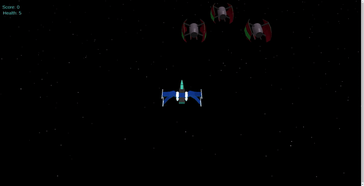
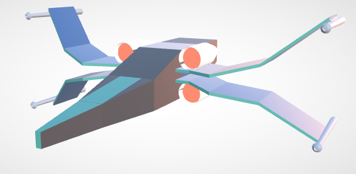
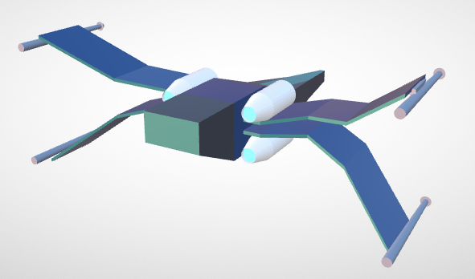
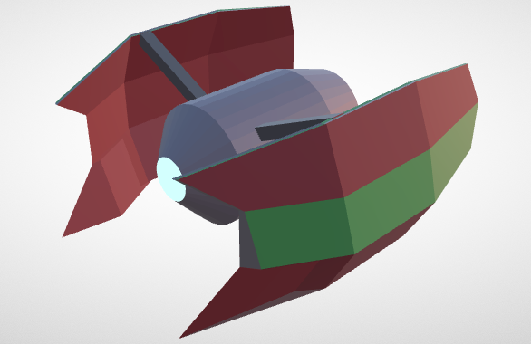
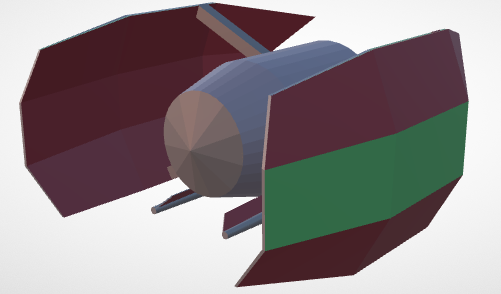
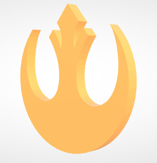

# Alpha Squadron
Fly your X-wing through a twinkling starfield in an attempt to escape the Empire! The rebellion is counting on you to lead an attack on an imperial factory but you're stuck behind enemy lines. Use the quad blaster on the X-wing to take out as many T.I.E fighters as possible, and recover stolen rebellion badges while you're at it. Good luck!


### Game Details
To start up the game, setup a server in this directory and the game should automatically load. A simple way to do this would be to use VSCode's live server extension. 

Use the ```w a s d``` keys to move around in the world and ```spacebar``` to shoot. Since the game is 3D the playable area is a frustum, which means that horizontal movement is less restricted further away from the camera. Beware however, as fighters spawn at the edges too and can catch you off guard. Each destroyed fighter is worth 10 points, and each recovered badge is worth 25 points. See if you can beat my high score of 4755 :)
### Implementation Details
The game logic and background were created using Javascript and WebGL along with the threeJS library (to simplify model loaders and creating shapes quickly). The code for the game can be found in ```/source/main.js```. All the models were made from scratch (heavy inspiration from Star Wars of course) using blender. Since this was my first time experimenting with blender the models are low-poly and don't have too much detail. My further advanced procedural generation experiments using blender can be found [here](https://github.com/Aa-Aanegola/legendary-brocolli). 

*X-wing front view*

*X-wing back view*

*TIE fighter front view*

*TIE fighter back view*

*Collectible badge*
### Trailer 
The trailer for the game can be found [here](https://drive.google.com/file/d/12qKqVKPpSWspb7C11VKPe_hpc_M7AZAy/view?usp=sharing).

*May the force be with you.*